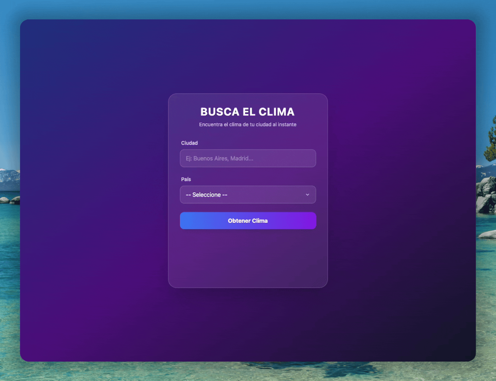

# Weather Finder

Weather Finder es una aplicación web moderna y responsiva diseñada para consultar el clima en tiempo real de cualquier ciudad del mundo. Construida con **HTML5**, **JavaScript (ES6+)** y **Tailwind CSS**, la aplicación ofrece una interfaz elegante con efectos de 'glassmorphism' y animaciones fluidas. Utiliza **Vite** como entorno de desarrollo y consume la **OpenWeatherMap API** para obtener datos precisos de temperatura (actual, máxima, mínima) y condiciones climáticas, gestionando errores y validaciones de forma amigable para el usuario.

## Demo

Para mirar la demo del proyecto visita: [Weather Finder](https://weather-finder-fetch.netlify.app/)



## Características

- **Búsqueda Global**: Consulta el clima de cualquier ciudad especificando el país.
- **Datos en Tiempo Real**: Temperatura actual, máxima, mínima y descripción del clima.
- **Interfaz Moderna**: Diseño atractivo utilizando Glassmorphism y gradientes.
- **Validaciones**: Mensajes de error claros para campos vacíos o ciudades no encontradas.
- **Diseño Responsivo**: Adaptable a diferentes tamaños de pantalla.
- **Spinner de Carga**: Indicador visual mientras se obtienen los datos.

## Tecnologías utilizadas

- **Vite**: Entorno de desarrollo y empaquetador ultrarrápido.
- **HTML5**: Estructura semántica.
- **Tailwind CSS**: Estilizado moderno y responsivo (vía CDN).
- **JavaScript (ES6+)**: Lógica de la aplicación, Fetch API y manipulación del DOM.
- **OpenWeatherMap API**: Fuente de datos meteorológicos.

## Instalación y requisitos

Para ejecutar este proyecto localmente, necesitarás Node.js instalado.

1.  **Clonar el repositorio**:

    ```bash
    git clone <URL_DEL_REPOSITORIO>
    cd weather-finder-fetch
    ```

2.  **Instalar dependencias**:

    ```bash
    npm install
    ```

3.  **Configuración de Variables de Entorno**:
    Crea un archivo `.env` en la raíz del proyecto y agrega tu API Key de OpenWeatherMap:

    ```env
    VITE_API_KEY=tu_api_key_aqui
    ```

    > **Nota**: Puedes obtener tu API Key registrándote gratuitamente en [OpenWeatherMap](https://openweathermap.org/).

4.  **Ejecutar el servidor de desarrollo**:
    ```bash
    npm run dev
    ```
    Abre la URL que aparece en la terminal (generalmente `http://localhost:5173`) en tu navegador.

## Cómo funciona

1.  **Ingreso de Datos**: El usuario ingresa el nombre de la ciudad y selecciona el país de la lista desplegable.
2.  **Validación**:
    - Si algún campo está vacío, se muestra una alerta roja indicando "Ambos campos son obligatorios".
    - La alerta desaparece automáticamente después de 3 segundos.
3.  **Consulta API**:
    - Se realiza una petición `fetch` a la API de OpenWeatherMap utilizando la key segura desde `.env`.
    - Se muestra un spinner de carga durante la petición.
4.  **Resultados**:
    - **Éxito**: Se muestra la ciudad, temperatura actual (en grados grandes), descripción del clima, y las temperaturas máxima y mínima.
    - **Error**: Si la ciudad no existe (código 404), se muestra una alerta indicando "Ciudad no encontrada".

## Estructura de archivos

```bash
.
├── css/
│   └── styles.css          # Estilos personalizados (complementarios a Tailwind)
├── js/
│   └── app.js              # Lógica principal: manejo de DOM y peticiones API
├── .env                    # Variables de entorno (no incluido en el repo)
├── index.html              # Punto de entrada de la aplicación
├── package.json            # Dependencias y scripts del proyecto
├── LICENSE                 # Archivo de licencia
├── README.md               # Documentación del proyecto
└── weather-finder.gif      # GIF demostrativo
```

### Descripción de archivos principales:

- **index.html**: Contiene el formulario de búsqueda y el contenedor para los resultados. Importa Tailwind CSS y define la configuración del tema.
- **js/app.js**: Maneja el evento submit del formulario, valida los inputs, realiza la petición a la API usando `import.meta.env.VITE_API_KEY`, convierte grados Kelvin a Centígrados y actualiza el DOM.

## Contribuciones

¡Las contribuciones son bienvenidas!

1.  Haz un Fork del proyecto.
2.  Crea una rama para tu funcionalidad (`git checkout -b feature/NuevaFuncionalidad`).
3.  Haz Commit de tus cambios (`git commit -m 'Agrega NuevaFuncionalidad'`).
4.  Haz Push a la rama (`git push origin feature/NuevaFuncionalidad`).
5.  Abre un Pull Request.

### Sugerencias

- Agregar pronóstico de 5 días.
- Detectar ubicación automática del usuario.
- Cambiar el fondo según el clima.

## Créditos

- **Juan Pablo De la Torre Valdez** - Instructor y autor del contenido del curso - [Codigo Con Juan](https://codigoconjuan.com/).
- **Mario Karajallo** - Implementación del proyecto y mantenimiento - [Mario Karajallo](https://karajallo.com).

## Licencia

Este proyecto está bajo la licencia MIT. Véase `LICENSE.md` para más detalles.

---

⌨️ con ❤️ por [Mario Karajallo](https://karajallo.com)
